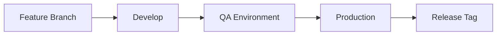

# 🚀 Deployment Guide - ERP API

## 📋 Pré-requisitos

### 1. **Ferramentas Necessárias**

```bash
# Instalar kubectl
curl -LO "https://dl.k8s.io/release/$(curl -L -s https://dl.k8s.io/release/stable.txt)/bin/linux/amd64/kubectl"
sudo install -o root -g root -m 0755 kubectl /usr/local/bin/kubectl

# Instalar gosec (security scanner)
go install github.com/securecodewarrior/gosec/v2/cmd/gosec@latest

# Instalar golangci-lint
go install github.com/golangci/golangci-lint/cmd/golangci-lint@latest
```

### 2. **Configuração do Kubernetes**

```bash
# Configurar acesso ao cluster
kubectl config use-context your-cluster-context

# Verificar conectividade
kubectl cluster-info
```

### 3. **Configuração do GitHub**

- Configurar secrets no GitHub repository
- Configurar environments (qa, production)
- Configurar branch protection rules

## 🔄 Fluxo de Deploy

### **Desenvolvimento → QA → Production**



## 🛠️ Comandos de Deploy

### **1. Deploy para QA**

```bash
# Verificar se está na branch develop
git checkout develop

# Executar validações
make validate

# Deploy para QA
make deploy-qa
```

### **2. Deploy para Production**

```bash
# Verificar se está na branch main
git checkout main

# Executar validações
make validate

# Criar release tag
make create-release

# Deploy para Production
make deploy-prod
```

## 🔧 Pipeline CI/CD

### **Trigger Automático**

- **Push para `develop`** → Deploy QA
- **Push para `main`** → Build e push da imagem
- **Release publicado** → Deploy Production

### **Jobs do Pipeline**

1. **Validate and Test**

   - Linter (golangci-lint)
   - Security scan (gosec)
   - Unit tests
   - Integration tests

2. **Build and Push**

   - Build Docker image
   - Push para GitHub Container Registry
   - Tag automático

3. **Deploy QA**

   - Deploy automático para QA
   - Smoke tests

4. **Deploy Production**
   - Deploy manual (apenas com release)
   - Smoke tests

## 🌐 Ambientes

### **QA Environment**

- **URL**: https://qa-api.seudominio.com
- **Namespace**: `qa`
- **Replicas**: 2
- **Resources**: 128Mi/100m (requests), 256Mi/200m (limits)

### **Production Environment**

- **URL**: https://api.seudominio.com
- **Namespace**: `production`
- **Replicas**: 3
- **Resources**: 256Mi/200m (requests), 512Mi/500m (limits)

## 🔐 Segurança

### **GORM - Proteção contra SQL Injection**

```go
// ❌ Vulnerável a SQL Injection
query := "SELECT * FROM users WHERE email = '" + email + "'"

// ✅ Seguro com GORM
db.Where("email = ?", email).First(&user)
```

### **Validações de Segurança**

```bash
# Executar security scan
make security-scan

# Executar todas as validações
make validate
```

## 📊 Monitoramento

### **Health Checks**

```bash
# Verificar status dos pods
kubectl get pods -n qa
kubectl get pods -n production

# Verificar logs
kubectl logs -f deployment/erp-api-qa -n qa
kubectl logs -f deployment/erp-api-prod -n production
```

### **Métricas**

- **Liveness Probe**: `/health` a cada 10s
- **Readiness Probe**: `/health` a cada 5s
- **Resource Monitoring**: CPU/Memory usage

## 🚨 Troubleshooting

### **Problemas Comuns**

#### **1. Deploy falha**

```bash
# Verificar logs do pod
kubectl logs <pod-name> -n <namespace>

# Verificar eventos
kubectl get events -n <namespace>

# Verificar configuração
kubectl describe deployment <deployment-name> -n <namespace>
```

#### **2. Service não responde**

```bash
# Verificar service
kubectl get svc -n <namespace>

# Verificar endpoints
kubectl get endpoints -n <namespace>

# Testar conectividade
kubectl port-forward svc/<service-name> 8080:80 -n <namespace>
```

#### **3. Ingress não funciona**

```bash
# Verificar ingress
kubectl get ingress -n <namespace>

# Verificar certificados
kubectl get secrets -n <namespace>

# Verificar DNS
nslookup <domain>
```

## 📝 Checklist de Deploy

### **Antes do Deploy**

- [ ] Código revisado e aprovado
- [ ] Testes passando localmente
- [ ] Validações de segurança executadas
- [ ] Branch correta (develop/main)
- [ ] Sem mudanças não commitadas

### **Durante o Deploy**

- [ ] Pipeline CI/CD executando
- [ ] Build da imagem bem-sucedido
- [ ] Deploy no ambiente de destino
- [ ] Pods em estado Running
- [ ] Health checks passando

### **Após o Deploy**

- [ ] Smoke tests executados
- [ ] API respondendo corretamente
- [ ] Logs sem erros críticos
- [ ] Métricas dentro do esperado
- [ ] Equipe notificada

## 🔄 Rollback

### **Rollback Automático**

```bash
# Rollback para versão anterior
kubectl rollout undo deployment/erp-api-qa -n qa
kubectl rollout undo deployment/erp-api-prod -n production

# Verificar status
kubectl rollout status deployment/erp-api-qa -n qa
```

### **Rollback Manual**

```bash
# Listar histórico de deployments
kubectl rollout history deployment/erp-api-qa -n qa

# Rollback para versão específica
kubectl rollout undo deployment/erp-api-qa --to-revision=2 -n qa
```

## 📞 Suporte

### **Contatos de Emergência**

- **DevOps**: devops@seudominio.com
- **SRE**: sre@seudominio.com
- **Slack**: #erp-api-alerts

### **Documentação Adicional**

- [Kubernetes Docs](https://kubernetes.io/docs/)
- [GitHub Actions](https://docs.github.com/en/actions)
- [GORM Documentation](https://gorm.io/docs/)
